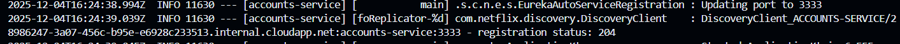
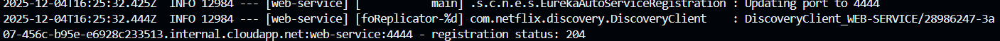
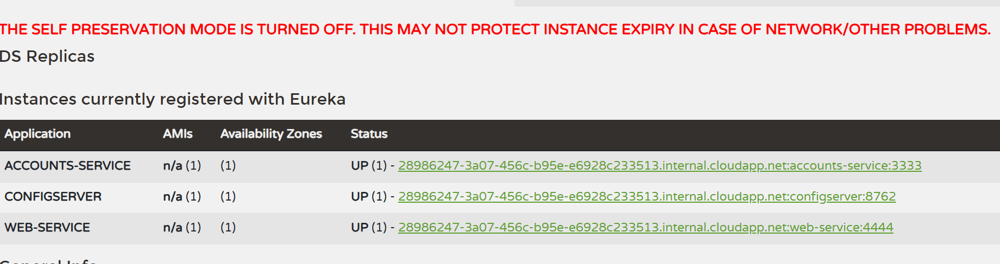
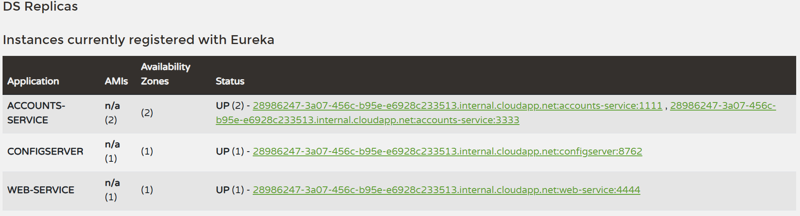
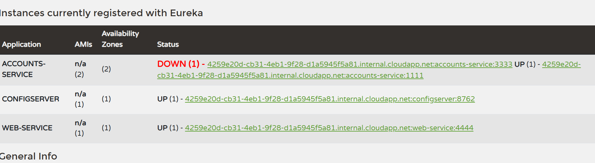
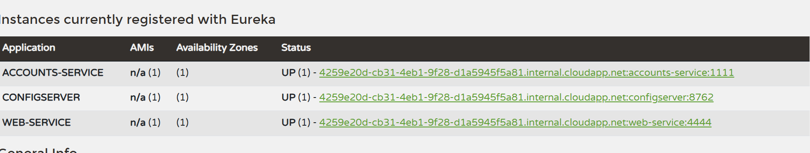
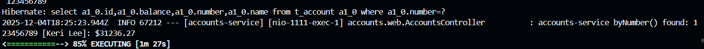

# Lab 6 Microservices - Project Report

## 1. Configuration Setup

**Configuration Repository**: [Link to the forked repository](https://github.com/titoMar008/lab6-microservices-Marcos)

Describe the changes you made to the configuration:

- What did you modify in `accounts-service.yml`?
I changed the value of the server port from 3333 to 1111, because 2222 was already in use.

- Why is externalized configuration useful in microservices?
Because it allows separating the configuration from the code. 
This enables dynamic configuration changes and deployments without the need to recompile the application.

---

## 2. Service Registration (Task 1)

### Accounts Service Registration



Explain what happens during service registration.
1. The service registers itself in eureka with its metadata.
2. Then the service will send heartbeats every 30 seconds to eureka.
3. The service will query eureka to discover other services.

### Web Service Registration



Explain how the web service discovers the accounts service.
1. First the service register itself in eureka like I explained before.
2. Then the service will query eureka for instances of ACCOUNT-SERVICE.
3. The load balancer will select an available instance and returns it to the web service.
4. The last step is that the web service will replace ACCOUNT-SERVICE with the real instance.

---

## 3. Eureka Dashboard (Task 2)



Describe what the Eureka dashboard shows:

- Which services are registered?
Accounts service and web service.
- What information does Eureka track for each instance?
Eureka tracks the status (UP/DOWN), the application name, the IP, the URL and the port of each service.

---

## 4. Multiple Instances (Task 4)



Answer the following questions:

- What happens when you start a second instance of the accounts service?
Eureka registers the second instance and shows it in the dashboard. It has the same
name and IP as the first account service but different port,
- How does Eureka handle multiple instances?
Eureka has an array of every instance of the account service.
- How does client-side load balancing work with multiple instances?
The client has the array with both instances,
so when it sends a request the client chooses between the instances in the array.

---

## 5. Service Failure Analysis (Task 5)

### Initial Failure



Describe what happens immediately after stopping the accounts service on port 3333.
The eureka dashboard shows that the service is down. 
The web service still working because its request were redirected to the other account service.

### Eureka Instance Removal



Explain how Eureka detects and removes the failed instance:

- How long did it take for Eureka to remove the dead instance?
Approximately 10 seconds this is due to ```lease-expiration-duration-in-seconds: 10``` in eureka configuration.
- What mechanism does Eureka use to detect failures?
The services have to send heartbeats to eureka server, if eureka has not received the heartbeat on time,
eureka detects a failure.

---

## 6. Service Recovery Analysis (Task 6)



Answer the following questions:

- Why does the web service eventually recover?
Because the requests to the account service are redirected from the down service on port the 3333 to the
healthy service on the port 1111
- How long did recovery take?
It takes between 1 and 31 seconds depending on when the failure occurs, because it is the add of eureka eviction time(1 second) and client cache refresh interval(30 seconds)
- What role does client-side caching play in the recovery process?
The cliente caches the instances provided by eureka, this is a trade-off, it reduces network traffic because
it eliminates the need to query eureka server for every request, but in the other side it introduces delay,
because the web service will route the traffic to the failed instance until the cache refreshes. 

---

## 7. Conclusions

Summarize what you learned about:

I have learned how the microservices works with eureka. Why is important to separate the code from the configuration.
I have checked the resilience and availability of the system by simulating the failure of an instance, and
how the system automatically recovers.

---

## 8. AI Disclosure

**Did you use AI tools?** (ChatGPT, Copilot, Claude, etc.)

I used Gemini like a guide, if there was something that I did not understand I asked gemini to explain me 
with examples.

---
